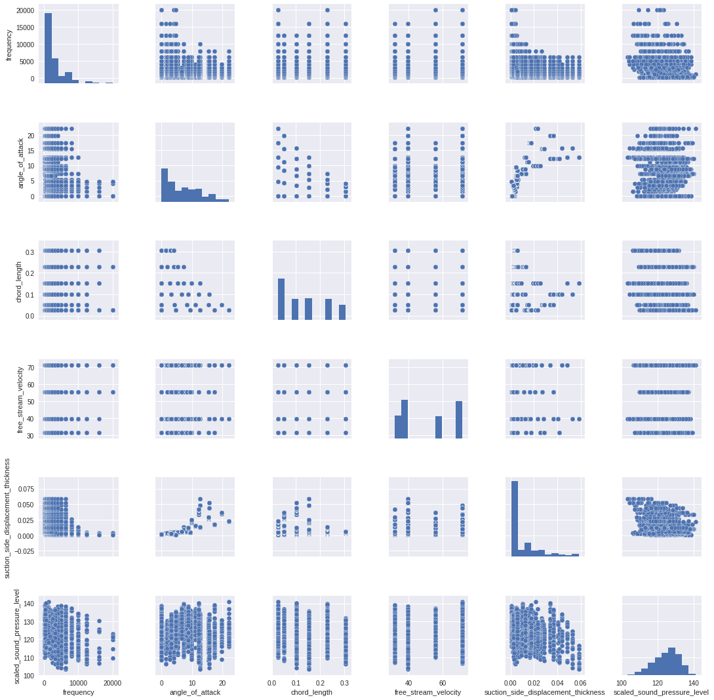
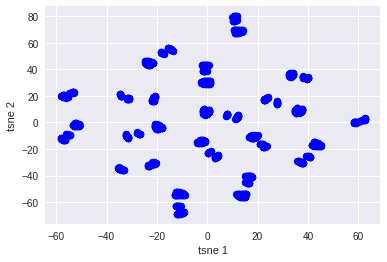

# Airfoil Self-noise prediction

[Website](https://claudinei-daitx.github.io/airfoil-self-noise-prediction/)

[Jypter Notebook](predict_airfoil_self_nose.ipynb)

  Submitted by :   
* Amarendra Sabat
* Claudinei Daitx
* Suwei (Stream) Qi

## Introduction

* The NASA data set comprises different size NACA 0012 airfoils at various wind tunnel speeds and angles of attack. 

* The span of the airfoil and the observer position were the same in all of the experiments.

* The NASA data set was obtained from a series of aerodynamic and acoustic tests of two and three-dimensional airfoil blade sections conducted in an anechoic wind tunnel.

* Relevant Papers:

  * T.F. Brooks, D.S. Pope, and A.M. Marcolini. 
Airfoil self-noise and prediction. 
Technical report, NASA RP-1218, July 1989. 

  * K. Lau. 
A neural networks approach for aerofoil noise prediction. 
Master’s thesis, Department of Aeronautics. 
Imperial College of Science, Technology and Medicine (London, United Kingdom), 2006. 

  * R. Lopez. 
Neural Networks for Variational Problems in Engineering. 
PhD Thesis, Technical University of Catalonia, 2008. 

* Citation :

* Dua, D. and Graff, C. (2019). UCI Machine Learning Repository [http://archive.ics.uci.edu/ml]. Irvine, CA: University of California, School of Information and Computer Science.

Link: [Airfoil Self-Noise Data Set](https://archive.ics.uci.edu/ml/datasets/Airfoil+Self-Noise#)

## 1. Required Python libraries

```python
import os
import warnings
import pandas as pd
import seaborn as sns
import numpy as np

# To plot pretty figures
%matplotlib inline
import matplotlib
import matplotlib.pyplot as plt
from IPython.core.display import HTML, display

# Machine learn packages
import tensorflow as tf
from sklearn.pipeline import Pipeline
from sklearn.model_selection import train_test_split
from sklearn.model_selection import GridSearchCV
from sklearn.linear_model import LinearRegression, Ridge, Lasso, ElasticNet, BayesianRidge
from sklearn.svm import SVR
from sklearn.preprocessing import StandardScaler, QuantileTransformer, MaxAbsScaler
from sklearn.decomposition import PCA
from sklearn.metrics import r2_score, mean_squared_error, mean_absolute_error
from mpl_toolkits.mplot3d import Axes3D
from tensorflow import keras

# Remove all warnings in this notebook
warnings.filterwarnings('ignore')
tf.logging.set_verbosity(tf.logging.ERROR)

# Same random seed state
np.random.seed(42)
random_state=42
```

## 2. Load airfloil dataset

### 2.1 Attribute Information

1. Frequency (Hertzs) 
2. Angle of attack (degrees)
3. Chord length (meters)
4. Free-stream velocity (meters per second) 
5. Suction side displacement thickness (meters)

The only output is: 
6. Scaled sound pressure level (decibels)


```python
airfoil_dataset.head()
```

<div>
<style scoped>
    .dataframe tbody tr th:only-of-type {
        vertical-align: middle;
    }

    .dataframe tbody tr th {
        vertical-align: top;
    }

    .dataframe thead th {
        text-align: right;
    }
</style>
<table border="1" class="dataframe">
  <thead>
    <tr style="text-align: right;">
      <th></th>
      <th>frequency</th>
      <th>angle_of_attack</th>
      <th>chord_length</th>
      <th>free_stream_velocity</th>
      <th>suction_side_displacement_thickness</th>
      <th>scaled_sound_pressure_level</th>
    </tr>
  </thead>
  <tbody>
    <tr>
      <th>0</th>
      <td>800</td>
      <td>0.0</td>
      <td>0.3048</td>
      <td>71.3</td>
      <td>0.002663</td>
      <td>126.201</td>
    </tr>
    <tr>
      <th>1</th>
      <td>1000</td>
      <td>0.0</td>
      <td>0.3048</td>
      <td>71.3</td>
      <td>0.002663</td>
      <td>125.201</td>
    </tr>
    <tr>
      <th>2</th>
      <td>1250</td>
      <td>0.0</td>
      <td>0.3048</td>
      <td>71.3</td>
      <td>0.002663</td>
      <td>125.951</td>
    </tr>
    <tr>
      <th>3</th>
      <td>1600</td>
      <td>0.0</td>
      <td>0.3048</td>
      <td>71.3</td>
      <td>0.002663</td>
      <td>127.591</td>
    </tr>
    <tr>
      <th>4</th>
      <td>2000</td>
      <td>0.0</td>
      <td>0.3048</td>
      <td>71.3</td>
      <td>0.002663</td>
      <td>127.461</td>
    </tr>
  </tbody>
</table>
</div>


```python
airfoil_dataset.tail()
```


<div>
<style scoped>
    .dataframe tbody tr th:only-of-type {
        vertical-align: middle;
    }

    .dataframe tbody tr th {
        vertical-align: top;
    }

    .dataframe thead th {
        text-align: right;
    }
</style>
<table border="1" class="dataframe">
  <thead>
    <tr style="text-align: right;">
      <th></th>
      <th>frequency</th>
      <th>angle_of_attack</th>
      <th>chord_length</th>
      <th>free_stream_velocity</th>
      <th>suction_side_displacement_thickness</th>
      <th>scaled_sound_pressure_level</th>
    </tr>
  </thead>
  <tbody>
    <tr>
      <th>1498</th>
      <td>2500</td>
      <td>15.6</td>
      <td>0.1016</td>
      <td>39.6</td>
      <td>0.052849</td>
      <td>110.264</td>
    </tr>
    <tr>
      <th>1499</th>
      <td>3150</td>
      <td>15.6</td>
      <td>0.1016</td>
      <td>39.6</td>
      <td>0.052849</td>
      <td>109.254</td>
    </tr>
    <tr>
      <th>1500</th>
      <td>4000</td>
      <td>15.6</td>
      <td>0.1016</td>
      <td>39.6</td>
      <td>0.052849</td>
      <td>106.604</td>
    </tr>
    <tr>
      <th>1501</th>
      <td>5000</td>
      <td>15.6</td>
      <td>0.1016</td>
      <td>39.6</td>
      <td>0.052849</td>
      <td>106.224</td>
    </tr>
    <tr>
      <th>1502</th>
      <td>6300</td>
      <td>15.6</td>
      <td>0.1016</td>
      <td>39.6</td>
      <td>0.052849</td>
      <td>104.204</td>
    </tr>
  </tbody>
</table>
</div>


```python
airfoil_dataset.describe()
```


<div>
<style scoped>
    .dataframe tbody tr th:only-of-type {
        vertical-align: middle;
    }

    .dataframe tbody tr th {
        vertical-align: top;
    }

    .dataframe thead th {
        text-align: right;
    }
</style>
<table border="1" class="dataframe">
  <thead>
    <tr style="text-align: right;">
      <th></th>
      <th>frequency</th>
      <th>angle_of_attack</th>
      <th>chord_length</th>
      <th>free_stream_velocity</th>
      <th>suction_side_displacement_thickness</th>
      <th>scaled_sound_pressure_level</th>
    </tr>
  </thead>
  <tbody>
    <tr>
      <th>count</th>
      <td>1503.000000</td>
      <td>1503.000000</td>
      <td>1503.000000</td>
      <td>1503.000000</td>
      <td>1503.000000</td>
      <td>1503.000000</td>
    </tr>
    <tr>
      <th>mean</th>
      <td>2886.380572</td>
      <td>6.782302</td>
      <td>0.136548</td>
      <td>50.860745</td>
      <td>0.011140</td>
      <td>124.835943</td>
    </tr>
    <tr>
      <th>std</th>
      <td>3152.573137</td>
      <td>5.918128</td>
      <td>0.093541</td>
      <td>15.572784</td>
      <td>0.013150</td>
      <td>6.898657</td>
    </tr>
    <tr>
      <th>min</th>
      <td>200.000000</td>
      <td>0.000000</td>
      <td>0.025400</td>
      <td>31.700000</td>
      <td>0.000401</td>
      <td>103.380000</td>
    </tr>
    <tr>
      <th>25%</th>
      <td>800.000000</td>
      <td>2.000000</td>
      <td>0.050800</td>
      <td>39.600000</td>
      <td>0.002535</td>
      <td>120.191000</td>
    </tr>
    <tr>
      <th>50%</th>
      <td>1600.000000</td>
      <td>5.400000</td>
      <td>0.101600</td>
      <td>39.600000</td>
      <td>0.004957</td>
      <td>125.721000</td>
    </tr>
    <tr>
      <th>75%</th>
      <td>4000.000000</td>
      <td>9.900000</td>
      <td>0.228600</td>
      <td>71.300000</td>
      <td>0.015576</td>
      <td>129.995500</td>
    </tr>
    <tr>
      <th>max</th>
      <td>20000.000000</td>
      <td>22.200000</td>
      <td>0.304800</td>
      <td>71.300000</td>
      <td>0.058411</td>
      <td>140.987000</td>
    </tr>
  </tbody>
</table>
</div>


    <class 'pandas.core.frame.DataFrame'>
    RangeIndex: 1503 entries, 0 to 1502
    Data columns (total 6 columns):
    frequency                              1503 non-null int64
    angle_of_attack                        1503 non-null float64
    chord_length                           1503 non-null float64
    free_stream_velocity                   1503 non-null float64
    suction_side_displacement_thickness    1503 non-null float64
    scaled_sound_pressure_level            1503 non-null float64
    dtypes: float64(5), int64(1)
    memory usage: 70.5 KB


### 2.2 Insights





*   There are only four free stream velocities.
    *   31.7 m/s
    *   39.6 m/s
    *   55.5 m/s
    *   71.3 m/s


*   There are six chord lengths:
    *   2.5 cm
    *   5 cm
    *   10 cm
    *   15 cm
    *   22 cm
    *   30 cm

## 3. Examine dimensions in a graphic

You can use this [concept](https://www.analyticsvidhya.com/blog/2018/08/dimensionality-reduction-techniques-python/) to reduce the number of features in your dataset without having to lose much information and keep or improve the model’s performance.  In this case, you can see two different dimensionality reductions PCA and T-SNE and, it shows that this dataset is non-linear.

### 3.1 Split features and targets

In this section, I will split the original dataset in two new datasets:

1. Features: all columns except the target column
2. Target: only the target column

### 3.2 Visualization using PCA

Using PCA is possible to see this dataset is non-linear and I can not get good results if I use a linear model such as Linear Regression. 


### 3.3 Visualization using t-SNE

Using T-SNE you can see in this dataset all the clusters and detect that you need a non-linear model to get the best results for the prediction.



## Choosing my model

### 4.1 Feature Engine

For this scenario I'm using three feature engines:

* Quantile transformer: This method transforms the features to follow a uniform or a normal distribution. This method is good when you work with non-linear datasets
* Max Abs scaler: Scale each feature by its maximum absolute value.
* Standard scaler: Standardize features by removing the mean and scaling to unit variance.

```python
train_set = QuantileTransformer(random_state=0).fit_transform(train_set)
train_set = MaxAbsScaler().fit_transform(train_set)
train_set = StandardScaler().fit_transform(train_set)
```

### Machine learning models

I have the class ModelEstimator to train and predict all models. In this case, I am using linear and non-linear models to see the difference between them.

Machine learning models:

* Lasso
* Linear regression
* Neural network
* SVR
* Bayesian Ridge
* Ridge
* ElasticNet


Now I am choosing a few models and parameters to test and get the best result for each model. In this case I do not need to choose a specific parameter because the ModelEstimator class is using GridSearchCV to decide the best estimator for each model.


### 4.3 Neural network


Another approach is to use neural networks to find best results. In this case,
I am using five hidden layers and Ridge (L2) for the regularization.


## Results


*   Using linear regressions such as LinearRegression the best model has an accuracy of nearby 45%.

*   Using non-linear regressions such as SVR the best model has an accuracy of nearby 79%. It is 34% more than linear models.

* Using a neural network the accuracy is around 88%. It is around 10% more than SVR.

For this dataset using a neural network, you can get the best result but, it does not mean the SVR not fit well. It means for this dataset and this amount of data (1503 rows) a neural network fits better than an SVR model.

<link rel="stylesheet" href="https://www.w3schools.com/w3css/4/w3.css"><table class="w3-table-all"><tr><th>Model</th><th>R2 score</th><th>MSE score</th></tr><tr><td>LinearRegression</td><td>0.4568062110663442</td><td>26.531048242586873</td></tr><tr><td>Ridge</td><td>0.45686912517307376</td><td>26.52797534809731</td></tr><tr><td>Lasso</td><td>0.45551532899816394</td><td>26.594098400972552</td></tr><tr><td>ElasticNet</td><td>0.45551532899816394</td><td>26.594098400972552</td></tr><tr><td>BayesianRidge</td><td>0.4568668381953528</td><td>26.52808705025128</td></tr><tr><td>SVR</td><td>0.7981376926095791</td><td>9.859498994362172</td></tr><tr><td>Neural network</td><td>0.8892580886540213</td><td>5.4089333351256155</td></tr></table>
